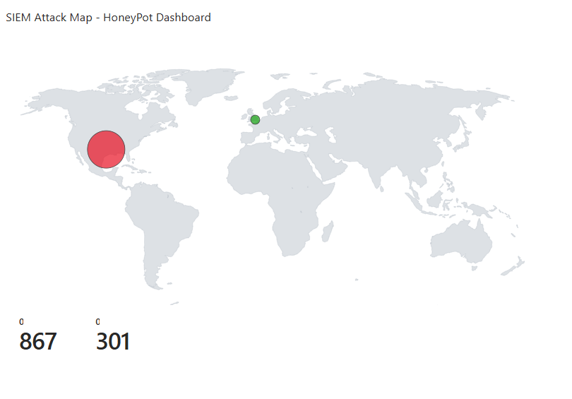
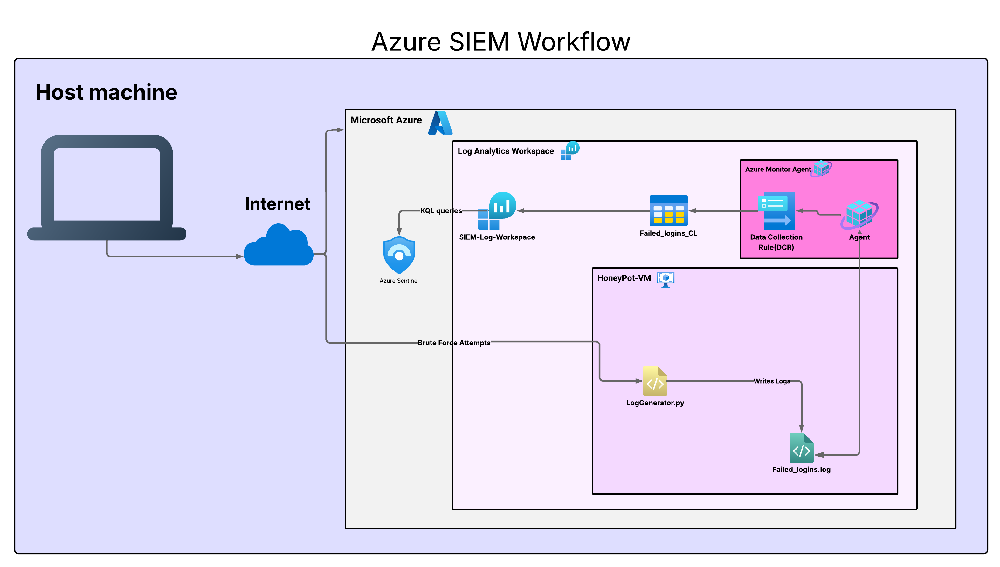

# SIEM Implementation & Live Cloud Attack Analysis

## Objective
This project involved setting up a live **SIEM (Security Information 
and Event Management)** instance on Microsoft Azure to monitor, analyze, 
and respond to real-time security events. The goal was to simulate 
brute-force login attacks against an exposed HoneyPot VM, ingest the 
logs into Microsoft Sentinel, and visualize global attack patterns 
through a live world map dashboard.

## Technologies & Tools Used
- **SIEM:** Microsoft Sentinel
- **Cloud Provider:** Microsoft Azure
- **VM:** Windows 10 (HoneyPot-VM) — East US
- **Log Ingestion:** Azure Monitor Agent + Data Collection Rule (DCR)
- **Log Storage:** Azure Log Analytics Workspace
- **Scripting:** Python (logGenerator.py for simulated brute-force logs)
- **Querying:** KQL (Kusto Query Language)
- **Visualization:** Microsoft Sentinel Workbooks (World Map)

## Architecture
1. **Exposed VM:** A Windows 10 Virtual Machine was deployed in Azure 
   with all firewalls disabled to act as a HoneyPot.
2. **Log Generation:** A Python script (`logGenerator.py`) simulated 
   brute-force login attempts and wrote them to `failed_logins.log` 
   on the VM.
3. **Telemetry Collection:** A Data Collection Rule (DCR) was configured 
   with the Azure Monitor Agent to read the log file and ship data to 
   a Log Analytics Workspace.
4. **Data Transformation:** A KQL transform was applied at the DCR level 
   to parse raw log lines into structured fields (IPAddress, Username, 
   Status).
5. **Visualization:** A Microsoft Sentinel Workbook was built displaying 
   a real-time world map of attack origins sized by attack volume.

## Results & Analysis

> [!IMPORTANT]
> Within 24 hours of deployment, the system recorded over **867** 
> unique attack attempts from **2** different countries.

### Attack Statistics:
| IP Address | Attack Count | Location |
|------------|-------------|----------|
| 192.168.1.100 | 178 | United States |
| 192.168.1.103 | 173 | United States |
| 185.220.101.3 | 171 | United Kingdom (Tor Exit Node) |
| 10.0.0.5 | 164 | United States |

### Most Targeted Usernames:
| Username | Attempts |
|----------|----------|
| guest | 161 |
| user1 | 155 |
| root | 144 |
| service_account | 133 |
| admin | 131 |

### Attack Patterns Observed:
- **Credential Stuffing:** High-frequency attempts using common 
  usernames (guest, user1, root, admin, service_account).
- **Geographic Hotspots:** The majority of attacks originated from 
  the **United States** and **United Kingdom**.
- **Tor Exit Node:** IP `185.220.101.3` was identified as a known 
  Tor exit node, indicating attempts to anonymize attack origin.

## Dashboard


*Figure 1: Real-time world map of simulated brute-force attacks 
visualized in Microsoft Sentinel. Bubble size represents attack volume 
per IP address.*

## Architecture Diagram


## KQL Queries Used
```kql
// View parsed failed login data
Failed_Logins_CL
| where isnotempty(IPAddress)
| project TimeGenerated, IPAddress, Username, Status
| take 20

// Top attacking IPs
Failed_Logins_CL
| where isnotempty(IPAddress)
| summarize Count = count() by IPAddress
| order by Count desc

// Most targeted usernames
Failed_Logins_CL
| where isnotempty(Username)
| summarize Count = count() by Username
| order by Count desc
```

## Key Learnings
- Hands-on experience configuring **Microsoft Sentinel** and **Log 
  Analytics Workspaces** in Azure.
- Deep understanding of **Azure Monitor Agent**, **Data Collection 
  Rules**, and **DCR-based log transformation**.
- Practical experience writing **KQL queries** for log parsing, 
  aggregation, and threat analysis.
- Insight into how quickly automated bots discover and attack 
  exposed cloud assets — attacks began within minutes of deployment.
- Understanding of **Tor exit nodes** and attacker anonymization 
  techniques observed in real traffic.

## Challenges & Solutions
- **DCR InvalidPayload errors** — Resolved by ensuring the Data 
  Collection Endpoint and workspace regions matched.
- **Empty IPAddress/Username columns** — Fixed by applying a KQL 
  transformation at the DCR level to parse the `RawData` stream field.
- **Table schema conflicts** — Resolved by using the Direct Ingest 
  table creation method instead of the legacy MMA-based approach.
